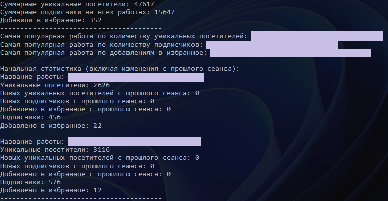

# WorkshopStatistics

**WorkshopStatistics** — это консольное приложение, которое позволяет отслеживать статистику ваших работ в [Steam Workshop](https://steamcommunity.com/workshop/) с помощью API Steam.

---

## О проекте

Я являюсь мододелом в Steam, и мне важно отслеживать статистику моих работ в мастерской. Этот инструмент помогает автоматически собирать данные о просмотрах, подписчиках и добавлениях в избранное, предоставляя удобный мониторинг изменений в реальном времени.

Мой данный проект разработан для:
- Получения статистики по работам в Steam Workshop.
- Отображения суммарных данных о просмотрах, подписчиках и добавлениях в избранное.
- Автоматического мониторинга изменений статистики.

---

## Установка и запуск

### Инструкция по запуску
1. Клонируйте репозиторий:
   ```bash
   git clone https://github.com/GitPolyakoff/workshop-statistics.git
2. Настройте конфигурацию:
Создайте файл `config.json` в корне проекта: `..\WorkshopStatistics\WorkshopStatistics\bin\Debug\`.
3. Скопируйте в него содержимое из `config.json.example` и заполните данными:
   ```bash
   {
    "apiKey": "ВАШ_API_КЛЮЧ",
    "userId": "ВАШ_USER_ID"
   }
**apiKey**: получите ключ [API Steam](https://steamcommunity.com/dev/apikey), указав свой домен (например, localhost).  


**userId**: это ваш Steam ID. Чтобы узнать его, откройте ваш профиль в Steam и скопируйте числовой идентификатор из URL.  


4. Укажите работы для отслеживания:
В файле `workshop_items.txt` перечислите ID ваших работ в мастерской (каждый ID на новой строке).

Найти ID работы можно в её URL. Например:
   ```bash
https://steamcommunity.com/sharedfiles/filedetails/?id=1234567891
```
Здесь `1234567891` — это ID работы.  


 5. Запустите программу:  
Запустите файл `WorkshopStatistics.exe`. Программа начнёт выводить статистику и отслеживать изменения в реальном времени.

## Скриншоты

### Пример вывода статистики  


---

## Используемые технологии

- Язык: **C#**
- Платформа: **.NET Framework**
- Библиотеки:
  - **Newtonsoft.Json** для работы с JSON.
  - **System.Net.Http** для выполнения HTTP-запросов.
- API: [Steam Web API](https://steamcommunity.com/dev)

---

## Контакты

- **Discord:** [Мой профиль](https://discordapp.com/users/913793634376241192/)
- **Steam:** [Мой профиль](https://steamcommunity.com/profiles/76561199147759312/)

---

### Лицензия

Этот проект распространяется под лицензией MIT. Подробнее см. в файле [LICENSE](LICENSE).
